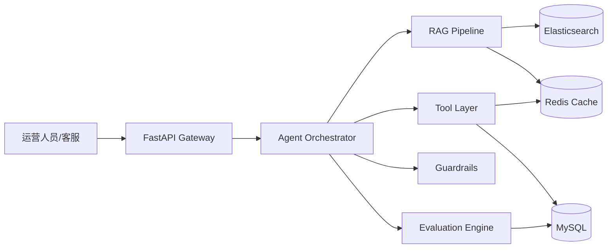
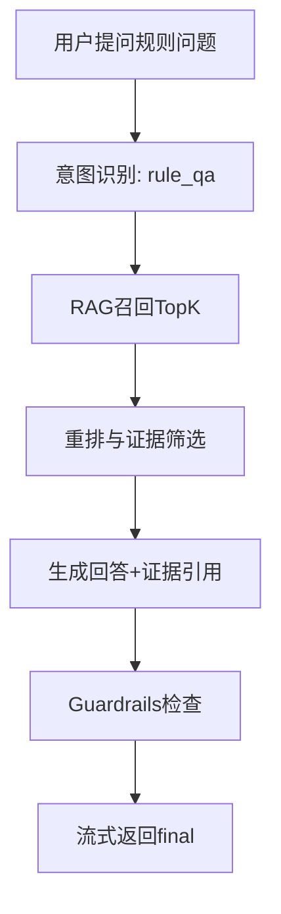
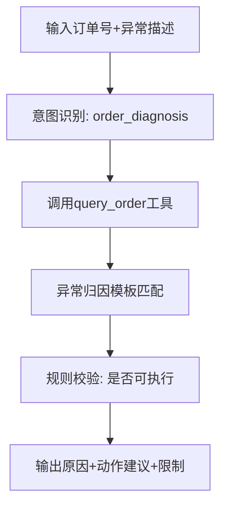
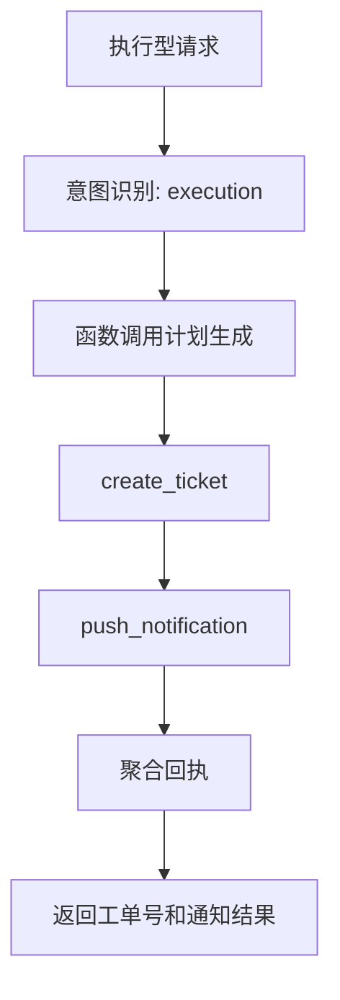

# 电商智能客服 AI Agent 系统设计技术方案（完整版）

# 一、需求分析

## 1.1 需求背景

**1. 需求分析**

- **背景**：面向电商商家运营场景，构建生产级 AI Agent，覆盖商品规则问答、活动 SOP 查询、订单异常定位、工单创建与通知推送。系统采用 `FastAPI + LangChain/LangGraph + RAG + Tool Calling + Redis/MySQL/Elasticsearch` 组合实现“检索 - 分析 - 执行 - 校验”的闭环。

- **存在的问题**：
  - 运营知识分散在 SOP 文档、FAQ、历史工单与口口相传经验中，检索成本高。
  - 异常定位依赖人工跨系统排查，路径长，响应慢。
  - 自动化执行链路薄弱，很多建议停留在“文本答案”，无法落到动作。
  - 缺乏统一评测口径，难以持续优化与自证效果。

- **期望形态**：
  - 以对话作为统一入口，支持问答、定位、执行三类任务。
  - 输出结果必须包含依据（evidence）与风险级别（risk level）。
  - 高风险动作必须走规则兜底，失败可回退。
  - 具备完整评测、回归与指标追踪能力，支撑简历与面试可自证。

## 1.2 业务名词

| 业务名词 | 业务解释 |
|---------|----------|
| 规则问答 | 围绕商品、发货、退换货、平台规则的说明性问答 |
| SOP 查询 | 按活动类型、节点、角色检索标准操作流程 |
| 订单异常 | 包括未发货、物流停滞、退款冲突、库存锁定失败等 |
| 工具调用 | 由模型触发的结构化业务动作，如订单查询、建工单、发通知 |
| Guardrails | 对高风险输出进行规则校验、阻断、降级与回退 |
| Evidence | RAG 检索片段或工具返回结构化证据 |
| 端到端成功率 | 无人工介入完成任务闭环的比例 |
| 回放评测 | 用固定 case 重跑链路并比较版本间结果 |

## 1.3 项目阶段规划（6小时冲刺版）

| 阶段 | 主要内容 | 输出产物 |
|------|----------|----------|
| 第1小时 | 工程骨架 + 最小 API | FastAPI + SSE + 基础测试 |
| 第2-4小时 | 三条核心链路替换 | RAG问答、异常定位、工单通知 |
| 第5小时 | 评测与回放 | 10-20 case + smoke |
| 第6小时 | 指标口径与文档 | 可自证数据 + 简历描述 |

## 1.4 引用文档

- 产品需求：`PROJECT_TECH_DOC.md`
- 开发计划：`docs/DEVELOPMENT_PLAN_8_STEPS.md`
- 第一步Spec：`docs/specs/step-01-foundation.md`

---

# 二、系统与流程设计

## 2.1 系统架构



**架构说明**：

- 接入层：FastAPI 提供 REST 与 SSE。
- 编排层：Orchestrator 负责意图识别、阶段调度、结果聚合。
- 能力层：
  - RAG：知识检索、重排、证据抽取。
  - Tools：订单查询、工单创建、通知推送。
  - Guardrails：规则校验、权限检查、风险分级。
- 数据层：
  - Redis：缓存会话摘要、热点知识、工具短期结果。
  - MySQL：业务主数据、执行日志、评测记录。
  - Elasticsearch：知识文档全文与混合检索。

### 2.1.1 核心访问模式与路由依据

- `访问模式一：规则/SOP问答 -> 检索证据 -> 生成回答`
- `访问模式二：订单异常定位 -> 工具查询 -> 归因建议`
- `访问模式三：执行请求 -> Function Calling -> 工单/通知`
- `结论：先做任务分类，再决定 RAG / Tool / 混合链路`

## 2.2 服务总体设计

### 2.2.1 功能点梳理

| 功能模块 | 具体功能 | 状态 |
|----------|----------|------|
| 对话入口 | SSE 流式响应、请求校验、trace_id | 已实现 |
| 编排调度 | 意图识别、阶段事件、结果聚合 | 开发中 |
| RAG问答 | 文档切分、召回、重排、引用输出 | 开发中 |
| 异常定位 | 订单查询、异常归因、规则校验 | 开发中 |
| 执行闭环 | 工单创建、通知推送、回执返回 | 开发中 |
| 评测体系 | case回放、指标统计、版本对比 | 计划中 |

### 2.2.2 关键流程设计

#### 2.2.2.1 规则问答流程



**详细步骤讲解：**

1. 用户输入规则问题（如“大促期间发货时效怎么算”）。
2. 编排器识别为 `rule_qa`，进入检索链路。
3. RAG 执行 query rewrite + hybrid retrieval + rerank。
4. 回答必须携带 evidence（文档ID/片段摘要）。
5. Guardrails 检查是否出现无依据断言或高风险建议。
6. SSE 输出 `intent/retrieve/final/done` 阶段事件。

#### 2.2.2.2 订单异常定位流程



**同步与异步拆分：**

- **同步部分**：参数校验、订单查询、归因推断、规则校验、返回建议。
- **异步部分**：落诊断日志、指标统计、告警触发。

#### 2.2.2.3 工单创建与通知流程



**失败回退策略：**

1. `create_ticket` 失败：中断链路，返回人工处理建议。
2. `create_ticket` 成功但 `push_notification` 失败：返回部分成功，并给出补发建议。

### 2.2.3 Prompt 与上下文组织

#### 2.2.3.1 系统提示词基线

```text
你是电商商家运营助手。你必须：
1) 先检索或查询，再给结论；
2) 不编造规则和订单状态；
3) 输出包含：结论、依据、可执行动作、风险提示；
4) 缺参数先澄清，不得擅自执行高风险动作。
```

#### 2.2.3.2 上下文分层

- `system`: 固定策略、边界、安全约束
- `conversation_summary`: 历史摘要，避免上下文过长
- `latest_user_goal`: 当前任务目标
- `retrieved_evidence`: 检索证据
- `tool_results`: 工具结构化返回

#### 2.2.3.3 风险注入防护

- 对用户输入做注入特征检测（如“忽略系统规则”）。
- 检索证据与用户指令隔离，不混拼。
- Tool 输出必须过 schema 校验再进入回答生成。

## 2.3 接口设计

### 2.3.1 HTTP 接口设计

| 序号 | 接口名称 | 路径 | 方法 | 功能描述 |
|------|----------|------|------|----------|
| 1 | 服务根检查 | `/` | GET | 返回服务元信息 |
| 2 | 健康检查 | `/api/v1/health` | GET | 返回服务健康状态 |
| 3 | 流式对话 | `/api/v1/chat/stream` | POST | 返回阶段化 SSE 事件 |
| 4 | 评测回放（规划） | `/api/v1/eval/replay` | POST | 回放 case 集并输出指标 |

#### 2.3.1.1 流式对话接口

**接口路径**：`POST /api/v1/chat/stream`

**请求参数**：

```json
{
  "user_id": "u_001",
  "session_id": "s_001",
  "message": "请帮我定位订单123456异常原因",
  "context": {
    "channel": "merchant_console"
  }
}
```

**响应形式**：`text/event-stream`

**事件样例**：

```json
{
  "trace_id": "c55f0ef6-0000-4d4d-9ef3-demo",
  "phase": "intent",
  "content": "已识别为订单异常定位请求",
  "meta": {
    "intent": "order_diagnosis"
  }
}
```

### 2.3.2 Tool 接口契约（Function Calling）

#### 2.3.2.1 query_order_status

```json
{
  "name": "query_order_status",
  "input_schema": {
    "type": "object",
    "properties": {
      "order_id": {"type": "string"}
    },
    "required": ["order_id"]
  }
}
```

#### 2.3.2.2 create_ticket

```json
{
  "name": "create_ticket",
  "input_schema": {
    "type": "object",
    "properties": {
      "order_id": {"type": "string"},
      "issue_type": {"type": "string"},
      "description": {"type": "string"}
    },
    "required": ["order_id", "issue_type", "description"]
  }
}
```

#### 2.3.2.3 push_notification

```json
{
  "name": "push_notification",
  "input_schema": {
    "type": "object",
    "properties": {
      "receiver_role": {"type": "string"},
      "message": {"type": "string"},
      "priority": {"type": "string", "enum": ["low", "medium", "high"]}
    },
    "required": ["receiver_role", "message", "priority"]
  }
}
```

## 2.4 系统建模设计

### 2.4.1 领域对象

| 实体 | 关键字段 | 说明 |
|------|----------|------|
| ConversationTrace | trace_id, user_id, session_id, intent, phases | 一次请求的全链路记录 |
| KnowledgeDocument | doc_id, source, title, content, tags | RAG 知识文档 |
| ToolExecutionLog | trace_id, tool_name, input, output, status | 工具执行审计 |
| EvalCase | case_id, input, expected, scene | 回放评测用例 |

### 2.4.2 数据库表示例（建议）

#### conversation_trace

```sql
CREATE TABLE conversation_trace (
  id BIGINT PRIMARY KEY AUTO_INCREMENT,
  trace_id VARCHAR(64) NOT NULL,
  user_id VARCHAR(64) NOT NULL,
  session_id VARCHAR(64) NOT NULL,
  intent VARCHAR(64) NOT NULL,
  risk_level VARCHAR(16) NOT NULL DEFAULT 'low',
  latency_ms INT NOT NULL DEFAULT 0,
  created_at DATETIME NOT NULL DEFAULT CURRENT_TIMESTAMP,
  INDEX idx_user_session(user_id, session_id),
  UNIQUE KEY uk_trace(trace_id)
);
```

#### tool_execution_log

```sql
CREATE TABLE tool_execution_log (
  id BIGINT PRIMARY KEY AUTO_INCREMENT,
  trace_id VARCHAR(64) NOT NULL,
  tool_name VARCHAR(64) NOT NULL,
  input_json JSON NOT NULL,
  output_json JSON,
  status VARCHAR(16) NOT NULL,
  error_msg VARCHAR(512) DEFAULT '',
  created_at DATETIME NOT NULL DEFAULT CURRENT_TIMESTAMP,
  INDEX idx_trace_tool(trace_id, tool_name)
);
```

## 2.5 评测与指标设计

### 2.5.1 指标定义

| 指标 | 定义 | 口径要求 |
|------|------|----------|
| Top-1命中率 | 标准答案是否在Top1证据中 | 必须标注样本总数 |
| Top-3命中率 | 标准答案是否在Top3证据中 | 必须标注样本总数 |
| 端到端成功率 | 无人工介入完成目标任务比例 | 必须定义成功条件 |
| 平均处理时延 | 请求到最终可执行建议耗时 | 必须定义统计窗口 |
| 工具成功率 | 成功调用次数/总调用次数 | 失败类型要分层统计 |

### 2.5.2 回放评测流程

1. 加载 `data/eval_cases` 下 case 集。
2. 执行统一编排链路，记录每阶段事件。
3. 自动计算命中率、成功率、平均时延。
4. 输出版本对比（例如 prompt v1 vs v2）。

### 2.5.3 最小评测样例结构

```json
{
  "case_id": "eval_001",
  "scene": "rule_qa",
  "input": "大促活动发货时效规则是什么",
  "expected_keywords": ["发货时效", "超时处理"],
  "expected_intent": "rule_qa"
}
```

## 2.6 测试用例（首版）

| 测试用例名称 | 测试步骤 | 预期结果 | 状态 |
|--------------|----------|----------|------|
| 健康检查可用 | 请求 `/api/v1/health` | 返回 `status=ok` | 已通过 |
| SSE链路可用 | 请求 `/api/v1/chat/stream` | 返回 intent/final/done | 已通过 |
| 规则问答命中 | 输入规则类问题 | 返回证据片段 | 待实现 |
| 异常定位闭环 | 输入订单异常 | 返回原因+建议+限制 | 待实现 |
| 工单通知闭环 | 执行请求 | 返回工单号+通知结果 | 待实现 |

---

# 三、稳定性设计

## 3.1 监控与告警

| 监控指标 | 告警阈值 | 告警方式 | 说明 |
|----------|----------|----------|------|
| SSE首包时延 | > 800ms | IM告警 | 影响对话体验 |
| 接口错误率 | > 3% | IM + 邮件 | 核心稳定性指标 |
| 工具失败率 | > 10% | IM告警 | 影响执行闭环 |
| Redis命中率 | < 70% | IM告警 | 影响性能 |
| 回放成功率 | 低于基线5% | 邮件告警 | 防回归 |

## 3.2 稳定性风险分析

### 3.2.1 强弱依赖分析

- **强依赖**：FastAPI服务、MySQL核心数据、基础模型调用。
- **弱依赖**：Redis缓存、Elasticsearch检索增强、通知通道。

### 3.2.2 典型风险与缓解

1. **模型幻觉**：必须要求 evidence；无证据降级回答。
2. **工具调用失败**：提供部分成功回执与人工接管建议。
3. **缓存异常**：回源数据库，允许性能下降但功能可用。
4. **提示词注入**：关键指令白名单 + 输入模式过滤。

### 3.2.3 降级策略

- RAG 不可用：改走模板化建议 + 明确“待确认”标识。
- Tool 不可用：输出人工操作路径，不做自动执行承诺。
- 通知失败：工单先成功，通知异步重试补偿。

## 3.3 容量预估（首版）

- 目标：日请求 3-5 万，峰值 QPS 20-50。
- 架构：单服务起步，可平滑扩容到多副本 + 负载均衡。
- 存储：
  - MySQL 保存执行与评测日志；
  - Redis 承载会话与热点缓存；
  - Elasticsearch 承载知识索引。

---

# 四、工程落地与交付

## 4.1 目录规范

```text
merchant-ops-agent/
├── app/
│   ├── api/v1/
│   ├── agents/
│   ├── core/
│   ├── guardrails/
│   ├── rag/
│   ├── schemas/
│   └── tools/
├── data/
│   ├── knowledge/
│   └── eval_cases/
├── docs/
│   ├── specs/
│   ├── DEVELOPMENT_PLAN_8_STEPS.md
│   ├── 电商智能客服AI-Agent系统设计技术方案（完整版）.md
│   └── 电商智能客服AI-Agent系统设计技术方案（豆包精简版）.md
└── tests/
```

## 4.2 里程碑验收标准

1. 最小 API 与 SSE 链路跑通。
2. 三条核心链路可独立验证。
3. 10-20 case 回放产出指标。
4. 指标口径可复述、可追溯、可复算。

## 4.3 简历可用成果表达（口径化）

- 完成电商运营 AI Agent 的分层架构设计与落地，实现问答、定位、执行三类任务编排。
- 构建 RAG + Tool Calling + Guardrails 的闭环链路，支持证据引用与风险兜底。
- 建立离线回放评测体系，围绕命中率、成功率与时延持续迭代优化。

---

# 五、附录

## 5.1 推荐命令

```bash
uvicorn app.main:app --host 0.0.0.0 --port 8000 --reload
pytest tests/test_health_api.py
```

## 5.2 下一步优先级

1. Step 2：统一编排协议与阶段事件。
2. Step 3：接入规则/SOP RAG问答闭环。
3. Step 4：接入订单异常定位工具链。
4. Step 5：接入工单通知执行链路。

## 5.3 面试拷打问答附录（20题）

### 5.3.1 项目定位与价值

**Q1：你这个项目和普通问答机器人有什么本质区别？**  
**A（答题框架）**：目标差异 -> 能力差异 -> 结果差异  
**示例回答**：普通问答机器人以文本回复为主，我这个项目是“可执行Agent”。它不仅回答规则问题，还能做订单异常定位并触发工单和通知，最终输出包含证据、动作和风险等级，形成业务闭环。

**Q2：为什么你要做三条链路（问答、定位、执行）而不是只做RAG？**  
**A（答题框架）**：业务需求 -> 技术边界 -> 工程闭环  
**示例回答**：商家真实诉求不止“知道答案”，还包括“定位原因”和“帮我处理”。纯RAG只能覆盖信息检索，无法保证执行落地，所以我把链路拆成问答、定位、执行，分别由RAG、Tool、Function Calling承接。

### 5.3.2 架构设计与取舍

**Q3：为什么选 FastAPI + SSE？为什么不是 WebSocket？**  
**A（答题框架）**：场景特征 -> 实现复杂度 -> 运维成本  
**示例回答**：当前主要是服务端单向流式输出，SSE足够且更轻量，接入和代理层配置也更简单。WebSocket更适合双向实时协作场景，后续如果有人工协同编辑或实时控制再切换会更合理。

**Q4：为什么需要 Orchestrator 层，直接让模型自己决定不行吗？**  
**A（答题框架）**：可控性 -> 可观测性 -> 可测试性  
**示例回答**：纯模型自治在稳定性和可复现性上不足。Orchestrator 把流程标准化成 intent/retrieve/tool/guard/final 阶段，便于打点、回放和定位故障，也便于做A/B与回归测试。

**Q5：你为什么把 Guardrails 单独做一层？**  
**A（答题框架）**：风险类型 -> 触发时机 -> 失败策略  
**示例回答**：因为高风险输出不能只靠prompt约束。我把规则校验独立出来，在最终输出前统一做权限、参数完整性和风险扫描，不通过就降级或阻断，避免“看起来合理但不可执行”的答案进入业务。

### 5.3.3 RAG 与知识库

**Q6：RAG 知识库数据源怎么组织？**  
**A（答题框架）**：数据分层 -> 元数据 -> 更新机制  
**示例回答**：我按规则、SOP、FAQ、案例四类组织，并给每条文档加来源、更新时间、业务域标签。检索结果必须回传来源，便于可解释；更新采用定期增量索引，避免全量重建。

**Q7：你怎么优化检索效果？**  
**A（答题框架）**：切分 -> 召回 -> 重排  
**示例回答**：先按语义块切分并保留标题层级，再做混合召回（关键词+向量），最后做语义重排。这样能在保证召回率的同时提升Top1准确性。

**Q8：如果检索不到证据怎么办？**  
**A（答题框架）**：检测条件 -> 降级输出 -> 追踪闭环  
**示例回答**：证据不足时不会强答，会输出“待确认建议+补充提问”。同时记录该query进入评测集，后续补文档或调召回策略，形成数据闭环。

### 5.3.4 Tool Calling 与执行链路

**Q9：工具调用如何保证稳定，不被模型乱调？**  
**A（答题框架）**：schema约束 -> 参数校验 -> 白名单  
**示例回答**：每个工具都有严格input schema，调用前做参数校验和权限校验，工具名白名单控制可用范围。模型只负责“决策”，不直接越过工具契约。

**Q10：执行链路部分成功怎么处理？**  
**A（答题框架）**：可回滚性 -> 结果分层 -> 用户可见性  
**示例回答**：比如工单创建成功但通知失败，我会返回“部分成功”状态，附工单号和补发建议；不会把整个请求判失败，避免用户重复触发造成脏操作。

**Q11：为什么需要执行日志（tool_execution_log）？**  
**A（答题框架）**：审计 -> 排障 -> 指标  
**示例回答**：执行日志是排障和复盘核心。可以定位是模型决策错、参数错还是工具失败，也能算工具成功率和平均调用耗时，支撑后续优化。

### 5.3.5 安全与风险控制

**Q12：你怎么防 Prompt 注入？**  
**A（答题框架）**：输入检测 -> 上下文隔离 -> 输出限制  
**示例回答**：先做输入模式检测拦截高风险指令，再把用户输入和系统策略、检索证据隔离，最后做输出规则检查，禁止越权和无依据执行建议。

**Q13：幻觉怎么控制？你怎么证明控制了？**  
**A（答题框架）**：机制 -> 指标 -> 案例  
**示例回答**：机制上要求回答必须绑定 evidence；指标上看“无证据回答率”和“人工判错率”；案例上对高风险场景采用规则兜底，未命中证据直接降级而非硬答。

### 5.3.6 评测与指标口径

**Q14：你提到成功率提升，成功率怎么定义？**  
**A（答题框架）**：任务定义 -> 成功条件 -> 统计窗口  
**示例回答**：端到端成功率定义为“无需人工介入完成目标任务”。例如异常定位成功需满足：能返回可核验原因+可执行建议；统计窗口按固定case集回放周期计算。

**Q15：Top-1 和 Top-3 命中率怎么评估？**  
**A（答题框架）**：标注集 -> 判断标准 -> 版本对比  
**示例回答**：先构建标注集，每条问题配标准证据。Top-1/Top-3 判断标准是标准证据是否出现在前K召回结果中。每次迭代固定同一评测集对比，保证可比性。

**Q16：如何避免“你把评测集喂进知识库导致虚高”？**  
**A（答题框架）**：数据隔离 -> 时间切分 -> 人工抽查  
**示例回答**：评测集与训练/调优样本隔离，按时间切分做“新问题集”回测，同时做人工抽查，避免数据泄漏导致虚高指标。

### 5.3.7 性能与稳定性

**Q17：系统瓶颈最可能在哪？**  
**A（答题框架）**：链路分段 -> 最慢环节 -> 优化路径  
**示例回答**：通常在检索重排和外部工具调用。优化优先级是：缓存热门query结果、并行非依赖工具调用、减少无效上下文长度。

**Q18：如果 Redis 挂了会怎样？**  
**A（答题框架）**：影响范围 -> 降级策略 -> 用户感知  
**示例回答**：会影响性能但不影响主流程可用。系统回源 MySQL/ES，SSE仍可返回，只是时延上升。优先保证“可用”，其次再恢复“快”。

### 5.3.8 个人贡献与可复制性

**Q19：你在这个项目里最关键的个人贡献是什么？**  
**A（答题框架）**：技术动作 -> 业务影响 -> 可复用资产  
**示例回答**：我把链路从“回答型”升级到“执行型”，并把流程标准化成可观测阶段事件，同时建立了回放评测框架。业务上缩短处理路径，工程上沉淀了可复用的Agent骨架与评测方法。

**Q20：如果再给你一周，你会优先做什么？**  
**A（答题框架）**：补短板 -> 增收益 -> 可验证  
**示例回答**：优先做三件事：第一，完善评测集覆盖边界case；第二，上线真实工具并加权限分级；第三，补监控告警和版本对比看板。这样能同时提升准确率、稳定性和可解释性。
