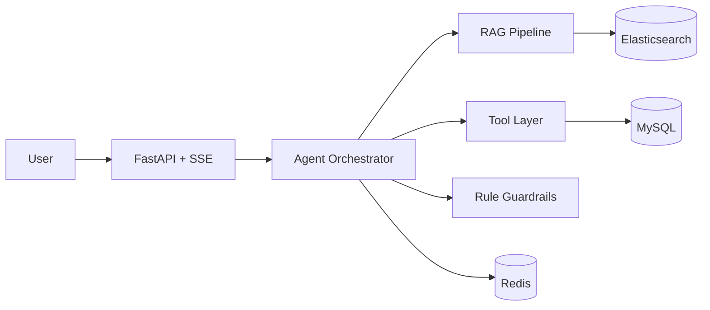

# 电商智能客服 AI Agent 系统设计技术方案（豆包精简版）

## 一、项目目标

面向电商商家运营场景，构建一个可落地的 AI Agent，完成三类核心任务：

1. 商品规则问答（RAG）
2. 订单异常定位（Tool + Rule Check）
3. 工单创建与通知（Function Calling）

目标是把“查资料 + 定位 + 执行”统一到一条对话闭环中。

---

## 二、系统架构（精简）



核心思路：先识别意图，再选择 RAG / Tool / 混合路径，最终统一走规则校验后输出。

---

## 三、三条核心链路

### 1) 规则问答链路

用户问题 -> 意图识别(rule_qa) -> 检索召回 -> 重排 -> 回答+证据 -> 风险校验 -> 输出

### 2) 异常定位链路

订单号+描述 -> 意图识别(order_diagnosis) -> 查询订单工具 -> 异常归因 -> 规则校验 -> 输出原因+建议

### 3) 执行闭环链路

执行请求 -> 生成调用计划 -> create_ticket -> push_notification -> 返回工单号和通知结果

---

## 四、接口设计（最小集）

| 接口 | 方法 | 说明 |
|------|------|------|
| `/` | GET | 服务元信息 |
| `/api/v1/health` | GET | 健康检查 |
| `/api/v1/chat/stream` | POST | 流式对话（SSE） |

`/api/v1/chat/stream` 输入：

```json
{
  "user_id": "u_001",
  "session_id": "s_001",
  "message": "请定位订单123456异常原因",
  "context": {"channel": "merchant_console"}
}
```

流式事件阶段：

- `intent`
- `retrieve`（后续接入）
- `tool`（后续接入）
- `guard`（后续接入）
- `final`
- `done`

---

## 五、指标口径（面试重点）

| 指标 | 定义 |
|------|------|
| Top-1/Top-3命中率 | 标准答案是否命中检索TopK |
| 端到端成功率 | 无人工介入完成任务比例 |
| 平均处理时延 | 请求到可执行建议输出耗时 |
| 工具成功率 | 成功调用次数/总调用次数 |

所有指标必须附带样本数、统计周期、基线版本。

---

## 六、风险与兜底

1. 幻觉风险：无证据不下结论，降级为“待确认建议”。
2. Prompt 注入：过滤越权指令，系统规则不可覆盖。
3. 工具失败：部分成功可返回，失败动作给人工补救路径。
4. 缓存异常：允许回源，优先保证功能可用。

---

## 七、当前进展与下一步

### 已完成

- Step 1 工程骨架落地：FastAPI + SSE 最小链路 + 基础测试。

### 下一步

1. Step 2：完善编排协议
2. Step 3：接入规则问答 RAG
3. Step 4：接入异常定位工具链
4. Step 5：接入工单通知执行链路

---

## 八、给豆包的核心一句话

这是一个“可执行”的电商运营 AI Agent：不仅回答问题，还能定位异常、触发工单与通知，并通过规则校验保障结果可信与可落地。
